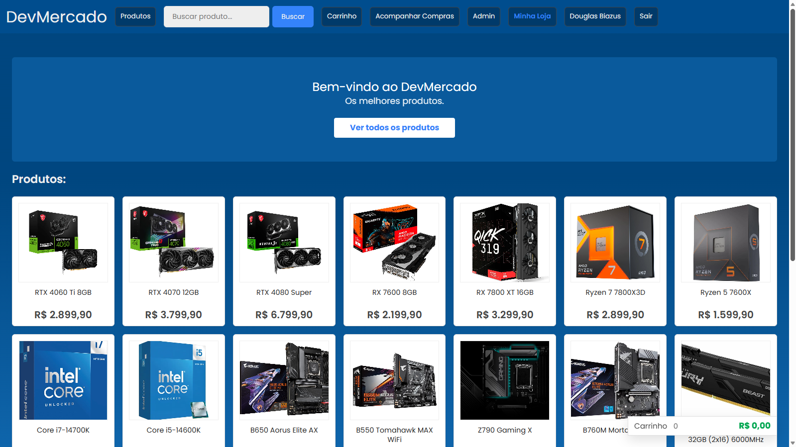

# DevMercado

> Sistema de e-commerce simples desenvolvido para a disciplina **Desenvolvimento de Aplicações Web II**.

Autores: [Douglas Biazus](https://github.com/douglasb78), [Saymon Rasador](https://github.com/saymonrasador)

Professor: Alexandre Krohn

---

**Descrição**

DevMercado é uma aplicação web para simular as principais funções de uma loja virtual: cadastro e login de usuários, navegação por produtos, carrinho de compras, realização e acompanhamento de pedidos, e um painel de administração.

Feito em PHP (padrões de projeto MVC e DAO) e PostgreSQL

**Como rodar (rápido)**

1. Ter PHP e PostgreSQL instalados.
2. Habilitar as extensões do PHP para o banco de dados.
3. Criar um banco de dados e importar `devmercado.sql`.
4. Ajustar a senha em `dao/config.php`.
5. Copiar o projeto para a pasta pública do Apache ou NGINX.
6. Abrir `http://localhost:8080` no navegador.

---

### Captura de Tela:

